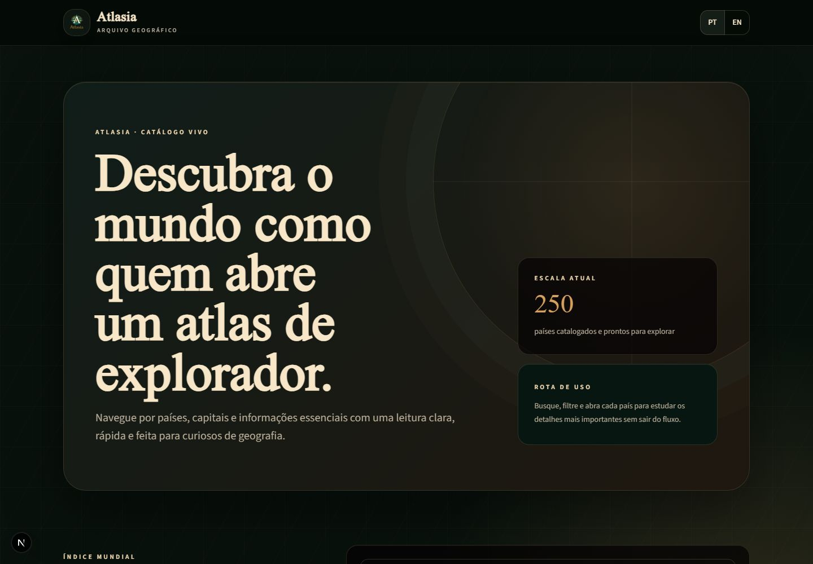
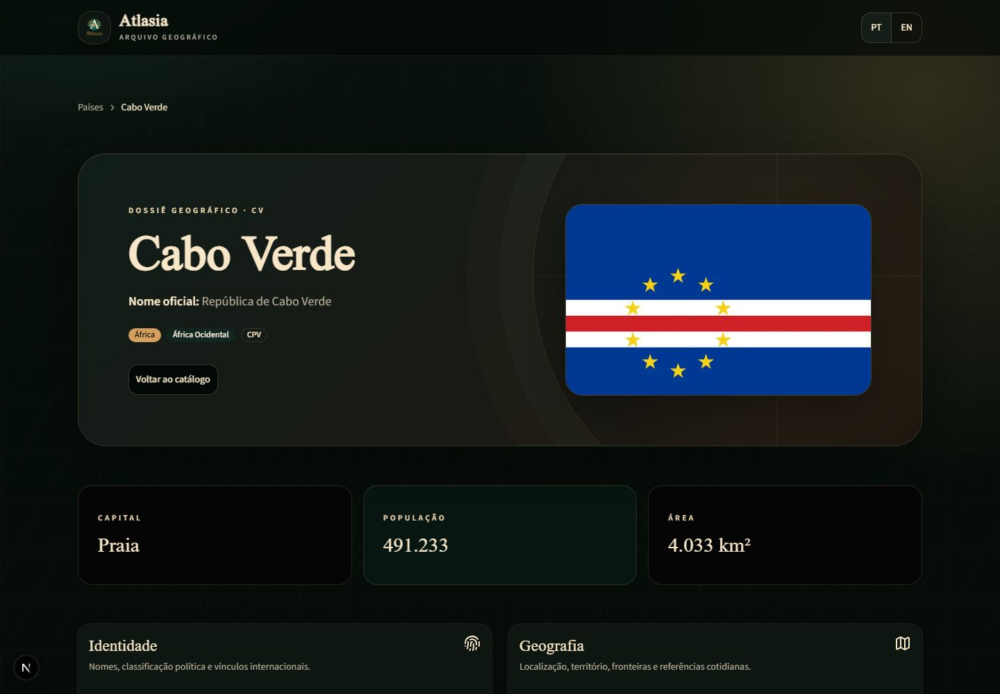
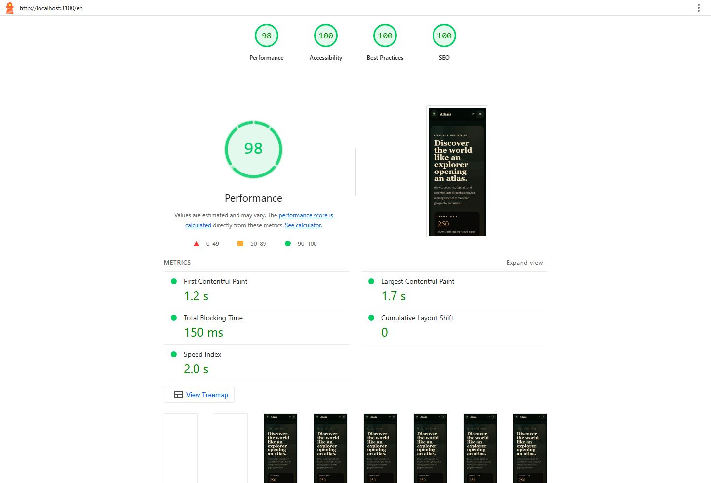
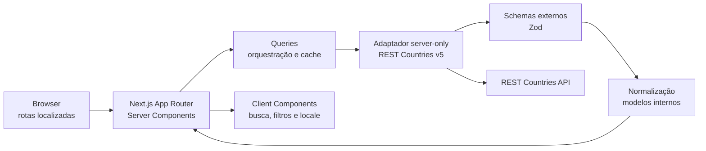

<div align="center">
  

# Atlasia

**Um atlas digital bilíngue para descobrir países com uma experiência editorial, rápida e acessível.**

[Demo](https://atlasia-world.vercel.app/) ·
[Arquitetura](#arquitetura) ·
[Qualidade](#qualidade-verificada) ·
[Como executar](#como-executar)

</div>



## Sobre o projeto

Atlasia transforma os dados da REST Countries em uma experiência de exploração
geográfica clara e compartilhável. O catálogo permite buscar por país ou capital,
combinar a busca com filtros regionais e abrir um dossiê completo de cada país.

O projeto nasceu para portfólio, mas foi tratado como produto: possui
internacionalização desde a raiz, validação de dados externos, arquitetura com
fronteiras explícitas, SEO técnico, dados estruturados, segurança defensiva,
acessibilidade WCAG 2.2 AA e budgets automatizados de performance.

### Principais recursos

- Catálogo com 250 países, busca instantânea e filtro por região.
- Cards com bandeira, nome localizado, capital, região e população.
- Perfil compartilhável por código ISO, organizado por assunto em vez de exibir
  o JSON bruto da API.
- Interface, URLs, metadata e formatação em português brasileiro e inglês.
- Rotas localizadas: `/pt-BR/paises/cv` e `/en/countries/cv`.
- Nomes de países via `Intl.DisplayNames` e traduções editoriais próprias para
  classificações retornadas apenas em inglês pela API.
- Estados localizados de loading, vazio, erro e página não encontrada.
- Metadata dinâmica, canonical, `hreflang`, sitemap, Open Graph e JSON-LD.
- Navegação por teclado, skip link, live regions, foco visível, reduced motion e
  layout funcional a 200% de zoom.
- API key restrita ao servidor, CSP e headers HTTP defensivos.

## Experiência

O catálogo entrega somente o resumo necessário para descoberta. O perfil consulta
uma projeção detalhada separada e apresenta identidade, geografia, população,
idiomas, moedas, códigos e conectividade em grupos compreensíveis.



A página dedicada é a experiência canônica porque oferece URL compartilhável,
metadata própria, navegação direta e melhor indexação. Um modal com rota
interceptada pode ser adicionado no futuro sem duplicar o conteúdo do perfil.

## Lighthouse e Core Web Vitals

As medições são executadas sobre um build de produção, em viewport mobile,
throttling simulado e três rodadas independentes por rota. O gate usa a mediana,
reduzindo o peso da variação natural do Lighthouse.



| Rota     | Performance | Accessibility | Best Practices | SEO |     LCP | CLS |
| -------- | ----------: | ------------: | -------------: | --: | ------: | --: |
| Catálogo |          98 |           100 |            100 | 100 | 1,664 s |   0 |
| Perfil   |          99 |           100 |            100 | 100 | 1,382 s |   0 |

O INP mediano da busca e do filtro foi **168 ms**. Os budgets do projeto são
Performance ≥ 90, Accessibility = 100, Best Practices ≥ 95, SEO = 100,
LCP ≤ 2,5 s, INP ≤ 200 ms e CLS ≤ 0,1.

O runner, o método, as causas medidas e as otimizações realizadas estão em
[`docs/performance-audit.md`](./docs/performance-audit.md).

## Arquitetura

Atlasia usa uma arquitetura **feature-first com Clean Architecture proporcional**.
A fronteira volátil — REST Countries — fica isolada, enquanto regras de domínio,
busca e formatação permanecem testáveis sem React, Next.js ou rede.



### Fluxo dos dados

1. A rota Server Component solicita resumos ou um perfil às queries.
2. O adaptador monta uma URL fixa, adiciona a credencial apenas no servidor e
   pede somente os campos necessários.
3. A resposta externa entra como `unknown` e precisa passar pelos schemas Zod.
4. Normalizadores puros convertem o contrato do provedor em modelos internos
   estáveis: `CountrySummary` e `CountryDetail`.
5. A interface recebe apenas dados validados e serializáveis.
6. Respostas bem-sucedidas usam revalidação diária; leituras equivalentes dentro
   da mesma renderização são deduplicadas.

Essa direção de dependências impede que mudanças futuras na API contaminem os
componentes ou o domínio. Não há uma hierarquia artificial de classes,
repositórios e casos de uso: novas abstrações só entram quando houver uma
substituição real, como outro provedor.

### Estrutura de pastas

```text
atlasia/
├── messages/                  # Dicionários pt-BR e en + teste de paridade
├── public/brand/              # Logo, favicon e ícones da marca
├── docs/                      # Auditorias e imagens do README
├── scripts/                   # Runners reproduzíveis de smoke e Lighthouse
├── src/
│   ├── app/[locale]/          # Rotas, layouts, metadata e route states
│   ├── components/
│   │   ├── layout/            # Shell e seletor de idioma
│   │   └── ui/                # Primitivas shadcn adaptadas ao tema
│   ├── config/                # Ambiente, site e políticas de segurança
│   ├── features/countries/
│   │   ├── api/               # DTOs Zod, cliente externo e normalizadores
│   │   ├── components/        # Catálogo, cards, hero e perfil
│   │   ├── model/             # Modelos e erros de domínio
│   │   ├── queries/           # Orquestração server-side e cache
│   │   └── utils/             # Busca, formatação, tradução e JSON-LD
│   ├── i18n/                  # Routing, request config e navegação localizada
│   └── lib/seo/               # Infraestrutura compartilhada de SEO
└── tests/
    ├── architecture/          # Testes das fronteiras de dependência
    ├── e2e/                   # Playwright, axe, SEO e segurança
    └── mocks/                 # Isolamento do ambiente de teste
```

## Stack e decisões

Cada dependência direta tem uma responsabilidade concreta:

| Tecnologia                           | Por que foi escolhida                                                                                                                                                                    |
| ------------------------------------ | ---------------------------------------------------------------------------------------------------------------------------------------------------------------------------------------- |
| **Next.js 16 / App Router**          | Entrega Server Components, layouts aninhados, metadata, sitemap, route states e cache no mesmo modelo. A renderização server-first reduz JavaScript no navegador e fortalece SEO.        |
| **React 19**                         | Base declarativa dos componentes e das pequenas ilhas interativas; a maior parte da aplicação continua no servidor.                                                                      |
| **TypeScript strict**                | Torna contratos e estados explícitos e detecta quebras entre API, domínio e apresentação antes da execução.                                                                              |
| **next-intl**                        | Centraliza locale, dicionários, navegação e pathnames localizados sem criar duas árvores de páginas. Também preserva o país atual durante a troca de idioma.                             |
| **Zod 4**                            | Valida ambiente, parâmetros e payloads externos em runtime. TypeScript não protege contra uma resposta real da API que mudou.                                                            |
| **REST Countries v5**                | Fonte especializada dos dados geográficos. É acessada somente pelo servidor, com projeções distintas para catálogo e perfil.                                                             |
| **shadcn/ui + Base UI**              | Fornece primitivas acessíveis e código sob controle do projeto. Os componentes são compostos e tematizados; a identidade visual não depende de um tema pronto.                           |
| **Tailwind CSS 4**                   | Mantém estilos próximos aos componentes e sustenta tokens semânticos de tinta, pergaminho, bronze e oceano. O CSS crítico é inlined pelo Next.js para reduzir o caminho de renderização. |
| **CVA, `clsx` e `tailwind-merge`**   | Organizam variantes e combinam classes previsivelmente sem espalhar condicionais ou conflitos de utilitários.                                                                            |
| **Lucide React**                     | Ícones consistentes, leves e com SVG controlável por CSS.                                                                                                                                |
| **tw-animate-css**                   | Disponibiliza transições pontuais compatíveis com as primitivas, sempre respeitando `prefers-reduced-motion`.                                                                            |
| **schema-dts**                       | Tipagem dos grafos Schema.org, reduzindo erros em `WebSite`, `CollectionPage`, `BreadcrumbList` e `Country`.                                                                             |
| **Vitest + Testing Library + jsdom** | Testes rápidos de domínio e componentes com foco no comportamento percebido pelo usuário.                                                                                                |
| **Playwright**                       | Valida o percurso real no Chromium: catálogo, busca, filtro, i18n, perfil, 404, SEO e headers.                                                                                           |
| **axe-core**                         | Automatiza verificações WCAG nas rotas representativas, complementando a auditoria manual.                                                                                               |
| **Lighthouse + Puppeteer Core**      | Executa budgets reproduzíveis no build de produção e registra métricas, relatórios HTML e JSON.                                                                                          |
| **ESLint + eslint-config-next**      | Aplica regras de qualidade e verificações específicas do framework antes do build.                                                                                                       |

### Decisões que orientam o projeto

- **Server Components por padrão:** somente busca, filtros e troca de idioma
  hidratam no cliente.
- **Resumo e detalhe separados:** o catálogo não paga pelo payload do perfil.
- **Código ISO na URL:** identificador estável, independente da tradução do nome.
- **API server-only:** a credencial nunca precisa entrar no bundle do navegador.
- **Validação na fronteira:** payload externo não é confiável até passar pelo Zod.
- **shadcn como primitiva:** comportamento reutilizado, direção visual autoral.
- **Página antes de modal:** melhor compartilhamento, indexação e progressive
  enhancement.
- **Performance medida:** otimizações respondem a métricas reais, não a suposições.

## Internacionalização

`pt-BR` é o locale padrão e `en` é a alternativa. O proxy negocia o idioma para
requisições sem prefixo, e todas as rotas públicas mantêm o locale explícito.

| Recurso   | Português              | Inglês                 |
| --------- | ---------------------- | ---------------------- |
| Catálogo  | `/pt-BR`               | `/en`                  |
| Perfil    | `/pt-BR/paises/[code]` | `/en/countries/[code]` |
| Mensagens | `messages/pt-BR.json`  | `messages/en.json`     |

O teste de paridade dos dicionários impede que uma chave exista em apenas um
idioma. Números, população, área, moedas e nomes de países usam as APIs `Intl`.
Valores editoriais vindos apenas em inglês da API passam por localizadores
explícitos, com fallback seguro para termos ainda desconhecidos.

## SEO e dados estruturados

- Metadata global e metadata dinâmica por país e idioma.
- Canonical próprio para cada versão localizada e alternates `pt-BR`/`en`.
- Sitemap com catálogo e perfis válidos em ambos os locales.
- `robots.txt`, manifest, favicon, Apple icon e Open Graph.
- JSON-LD renderizado no servidor e serializado com proteção contra injeção.
- `WebSite` e `CollectionPage` no catálogo.
- `BreadcrumbList` e `Country` nos perfis.

Os dados estruturados representam somente conteúdo visível; não há schemas
artificiais de produto, avaliações ou FAQ. Consulte os testes em
`src/lib/seo` e `src/features/countries/utils`.

## Acessibilidade

O alvo é WCAG 2.2 nível AA. Além do axe automatizado, a experiência foi revisada
manualmente para:

- ordem de foco, teclado e foco visível;
- landmarks, headings, labels e textos alternativos;
- anúncio da contagem de resultados por live region;
- contraste e alvos de interação;
- reflow em 320 px e zoom de 200%;
- espaçamento de texto e ausência de overflow;
- preferência por movimento reduzido.

O resultado e as limitações estão documentados em
[`docs/accessibility-audit.md`](./docs/accessibility-audit.md).

## Segurança

O site não possui login, banco de dados ou mutações públicas. Por isso, a defesa
é proporcional à superfície real:

- `REST_COUNTRIES_API_KEY` validada e importada somente em módulos `server-only`;
- URL do provedor constante e parâmetros ISO validados antes do fetch;
- respostas externas tratadas como desconhecidas e validadas com Zod;
- mensagens de erro controladas, sem payload, stack ou segredo;
- CSP restritiva e allowlist específica para as bandeiras;
- HSTS em produção, proteção contra clickjacking e MIME sniffing;
- `Permissions-Policy`, `Referrer-Policy` e `Cross-Origin-Opener-Policy`;
- `X-Powered-By` desativado;
- auditoria de dependências e busca por secrets antes da entrega.

A análise completa e os riscos residuais estão em
[`docs/security-audit.md`](./docs/security-audit.md).

## Como executar

### Pré-requisitos

- Node.js **20.9 ou superior**.
- npm.
- Uma credencial válida da REST Countries API v5.

### Instalação

```bash
git clone https://github.com/Gaabriel22/atlasia.git
cd atlasia
npm install
```

Crie o arquivo local de ambiente:

```bash
cp .env.example .env
```

No PowerShell:

```powershell
Copy-Item .env.example .env
```

Preencha as variáveis:

```dotenv
SITE_URL=http://localhost:3000
REST_COUNTRIES_API_KEY=sua-chave-aqui
```

| Variável                 | Obrigatória | Descrição                                                                                                                                                                      |
| ------------------------ | :---------: | ------------------------------------------------------------------------------------------------------------------------------------------------------------------------------ |
| `SITE_URL`               |     Sim     | Origem absoluta usada em canonical, sitemap, Open Graph e JSON-LD. Aceita HTTPS ou HTTP apenas em `localhost`/`127.0.0.1`. Não inclua barra final, path, query ou credenciais. |
| `REST_COUNTRIES_API_KEY` |     Sim     | Bearer token lido exclusivamente pelo servidor para consultar a API v5.                                                                                                        |

Inicie o ambiente de desenvolvimento:

```bash
npm run dev
```

Acesse [http://localhost:3000](http://localhost:3000). A raiz negocia o idioma
do navegador e redireciona para um locale suportado.

## Scripts

| Comando                   | Função                                                                |
| ------------------------- | --------------------------------------------------------------------- |
| `npm run dev`             | Inicia o Next.js em desenvolvimento.                                  |
| `npm run build`           | Gera e valida o build de produção.                                    |
| `npm run start`           | Serve o build de produção.                                            |
| `npm run lint`            | Executa ESLint.                                                       |
| `npm run typecheck`       | Valida TypeScript sem emitir arquivos.                                |
| `npm test`                | Executa a suíte Vitest uma vez.                                       |
| `npm run test:watch`      | Executa Vitest em modo interativo.                                    |
| `npm run test:e2e`        | Executa toda a suíte Playwright.                                      |
| `npm run test:e2e:smoke`  | Faz build e executa os nove percursos críticos marcados com `@smoke`. |
| `npm run test:e2e:ui`     | Abre a interface do Playwright para investigação local.               |
| `npm run test:lighthouse` | Faz build, audita catálogo e perfil três vezes e aplica os budgets.   |

Os relatórios Lighthouse são gravados em `.lighthouse/` e não são versionados.
Para uma iteração mais curta:

```bash
npm run test:lighthouse -- --runs=1
node scripts/run-lighthouse.mjs --skip-build --runs=3 --interaction-only
```

## Qualidade verificada

A estratégia combina níveis diferentes em vez de depender de uma única suíte:

- **Unitários:** schemas, normalizadores, formatadores, busca, erros e JSON-LD.
- **Componentes:** cards, catálogo, perfil, fallbacks e anúncios acessíveis.
- **Arquitetura:** domínio sem imports de React, Next.js, rede ou DTO externo.
- **E2E:** descoberta, filtros, teclado, i18n, perfil, 404, SEO e segurança.
- **Acessibilidade:** axe nas rotas representativas e auditoria manual.
- **Performance:** Lighthouse mobile e interação real com CPU 4× mais lenta.

Antes de uma entrega:

```bash
npm run lint
npm run typecheck
npm test
npm run test:e2e:smoke
npm run build
npm audit
npm run test:lighthouse
```

## Deploy na Vercel

1. Importe o repositório na Vercel.
2. Mantenha o preset de framework como **Next.js**.
3. Cadastre `REST_COUNTRIES_API_KEY` como variável protegida nos ambientes
   necessários.
4. Defina `SITE_URL=https://atlasia-world.vercel.app` em produção.
5. Faça o deploy e confirme `/robots.txt`, `/sitemap.xml`, os dois locales,
   um perfil e os headers de segurança.
6. Execute novamente os smoke tests e o Lighthouse contra a versão candidata
   antes de divulgar o domínio.

> [!WARNING]
> Não use `NEXT_PUBLIC_` na credencial e não copie o conteúdo do `.env` para
> configurações client-side. O repositório versiona somente `.env.example`.

## Próximas evoluções

- Modal de perfil com rota interceptada, preservando a página canônica.
- Monitoramento de Core Web Vitals com dados de campo.
- Links factuais entre países relacionados.
- Revalidação sob demanda por tag.
- Novas experiências educacionais construídas sobre os mesmos modelos internos.

---

<div align="center">
  Feito como projeto de portfólio por
  <a href="https://github.com/Gaabriel22">Gabriel</a>.
</div>
